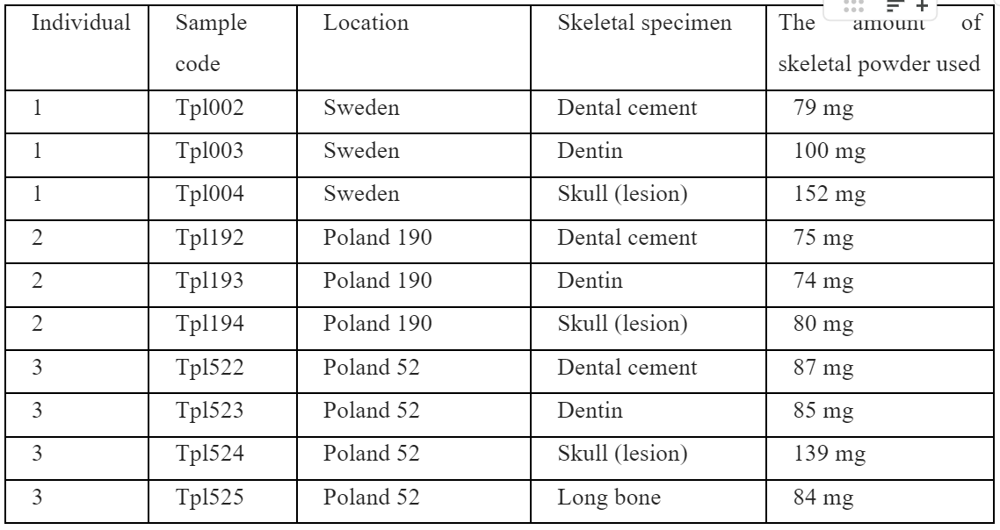

# tpl-mag
"Analyzing Ancient DNA through DNA Concatenation Methods"

This study aims to analyze ancient DNA samples using DNA assembly methods without the use of a reference genome. The objective of this research is to enhance the accuracy of ancient DNA analyses, enabling the retrieval of precise results from genetic material of the past. Furthermore, through a comprehensive comparison with reference-based methods using the same samples, we intend to evaluate the outcomes of these two distinct approaches. These comparisons will contribute to a deeper understanding of the reliability and sensitivity of ancient DNA analyses, thereby advancing our capacity to access genetic information from ancient eras.

## Preliminary analysis of TPL samples

### Introduction

Our research in ancient metagenomic analysis employs de novo assembly and rigorous statistical examination to uncover the genetic composition of microbial communities within environmental samples. We synthesize contigs, elongated DNA sequences, by amalgamating short, ancient DNA fragments, utilizing the MEGAHIT tool designed for our TPL metagenomic data, which includes both ancient and short reads. Post-initial assembly, we conduct a comprehensive evaluation of contig sequence quality through metagenomic statistical analyses, aligning sequences to FASTA files using tools like Bowtie2 and SAMtools. Then, the readings that do not meet their sufficient length, sufficient reading depth, sufficient reading coverage percentage are filtered and discarded.This stringent filtering ensures precision in contig sequences and accuracy in identifying genetic variations.

In essence, our method orchestrates a systematic exploration into the complexities of ancient metagenomic data. By strategically combining de novo assembly techniques for contig synthesis and utilizing bioinformatics tools such as MEGAHIT, Bowtie2, and SAMtools for metagenomic statistical analyses, our research aims to ensure the reliability and accuracy of the genetic information obtained, providing a comprehensive understanding of microbial ecosystems and genetic landscapes.


## Working Server: Truba

This study is conducted utilizing the technological infrastructure of TRUBA (Turkish National Academic Network and Information Center High-Performance Computing Center), which belongs to TÜBITAK ULAKBIM. TRUBA is a national e-Infrastructure providing services such as high-performance computing, data-intensive computing, scientific data repositories, and cloud computing. We express our gratitude to TRUBA for enabling the data analyses and computations conducted within the scope of this study.

## Materials and Methods

### Sampling

In the scope of this research, dentin, cement, and skeletal samples from three individuals obtained from Poland and Sweden were utilized (Table 1). These samples were processed by Dr. Maja Krzewinska at Stockholm University's Paleogenetics Center and subsequently sent for DNA sequencing. Within the context of our study, we employed the DNA libraries derived from these samples.




```
mkdir results
cd results/
mkdir assembly
mkdir classification
```