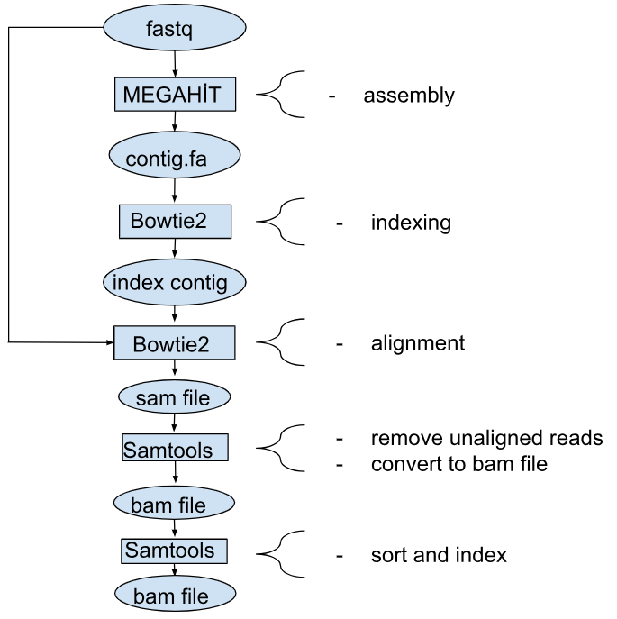

# tpl-mag

## Analyzing Ancient DNA through DNA Concatenation Methods

This study aims to analyze ancient DNA samples using DNA assembly methods without the use of a reference genome. The objective of this research is to enhance the accuracy of ancient DNA analyses, enabling the retrieval of precise results from genetic material of the past. Furthermore, through a comprehensive comparison with reference-based methods using the same samples, we intend to evaluate the outcomes of these two distinct approaches. These comparisons will contribute to a deeper understanding of the reliability and sensitivity of ancient DNA analyses, thereby advancing our capacity to access genetic information from ancient eras.

## Preliminary analysis of TPL samples

### Introduction

Our research in ancient metagenomic analysis employs de novo assembly and rigorous statistical examination to uncover the genetic composition of microbial communities within environmental samples. We synthesize contigs, elongated DNA sequences, by amalgamating short, ancient DNA fragments, utilizing the MEGAHIT tool designed for our TPL metagenomic data, which includes both ancient and short reads. Post-initial assembly, we conduct a comprehensive evaluation of contig sequence quality through metagenomic statistical analyses, aligning sequences to FASTA files using tools like Bowtie2 and SAMtools. Then, the readings that do not meet their sufficient length, sufficient reading depth, sufficient reading coverage percentage are filtered and discarded.This stringent filtering ensures precision in contig sequences and accuracy in identifying genetic variations.

In essence, our method orchestrates a systematic exploration into the complexities of ancient metagenomic data. By strategically combining de novo assembly techniques for contig synthesis and utilizing bioinformatics tools such as MEGAHIT, Bowtie2, and SAMtools for metagenomic statistical analyses, our research aims to ensure the reliability and accuracy of the genetic information obtained, providing a comprehensive understanding of microbial ecosystems and genetic landscapes.


## Working Server: Truba

This study is conducted utilizing the technological infrastructure of TRUBA (Turkish National Academic Network and Information Center High-Performance Computing Center), which belongs to TÜBITAK ULAKBIM. TRUBA is a national e-Infrastructure providing services such as high-performance computing, data-intensive computing, scientific data repositories, and cloud computing. We express our gratitude to TRUBA for enabling the data analyses and computations conducted within the scope of this study.
Important note!: Please add your own server name, username, email to the required sections while your users are running the scripts. Depending on the size of your data and taking into account the number of cores provided to you by your presentation, it is necessary to optimize the number of cores you request and the processing time according to yourself

## Materials and Methods

### Sampling

In the scope of this research, dentin, cement, and skeletal samples from three individuals obtained from Poland and Sweden were utilized (Table 1). These samples were processed by Dr. Maja Krzewinska at Stockholm University's Paleogenetics Center and subsequently sent for DNA sequencing. Within the context of our study, we employed the DNA libraries derived from these samples.

Table 1: Samples to be used in the study. Adequate DNA could not be obtained from the Tpl194 sample. Stradomska is an archaeological site located in Krakow, Poland.
|Individual| sample |    Location       | Skeletal specimen  |The amount of skeletal powder used|
|----------|--------|-------------------|--------------------|----------------------------------|
|     1    |TPL002  |	Sweden          |	  Dental cement  |             79 mg                |
|     1    |TPL003  |	Sweden          |	  Dentin  	     |             100 mg               |
|     1    |TPL004  |	Sweden          |	  Skull (lesion) |             152 mg               |
|     2    |TPL192  |	Poland 19       |	  Dental cement  |             75 mg                |
|     2    |TPL193  |	Poland 190      |	  Dentin         |             74 mg                |
|     2    |TPL194  |   Poland 190      |     Skull (lesion) |             80 mg                |
|     3    |TPL522  |	Poland 52       |	  Dental cement  |             87 mg                |
|     3    |TPL523  |	Poland 52       |	  Dentin       	 |             85 mg                |
|     3    |TPL524  |	Poland 52       |	  Skull (lesion) |             139 mg               |
|     3    |TPL525  |	Poland 52       |	  Long bone 	 |             84 mg                |

Stradomska is a site name (in Cracow, Poland).

#### Samples and fastq files

With this command, you can view how many reads there are in each fastq file. We have shown the lengths in Table 2 for TPL data
```
for file in sample*.fastq.gz; do zcat "$file" | wc -l | awk -v var="$file" '{print var " " $1/4}'; done
```
Table 2: TPL examples show the reading numbers in fasq files.
|sample fastq file|number of readings|
|-----------------|------------------|
|TPL002.fastq     |    66352800      |
|TPL003.fastq     |    61041132      |
|TPL004.fastq     |    43829890      |
|TPL192.fastq     |    48247075      |
|TPL193.fastq     |    42732089      |
|TPL522.fastq     |    43524150      |
|TPL523.fastq     |    84824896      |
|TPL524.fastq     |    49005667      |
|TPL525.fastq     |    44728747      |

### De novo assembly of fastq files
Given that our TPL metagenomic data consists of ancient and short reads, anticipating a high degree of similarity between DNA fragments from each organism, we conducted the de novo metagenome assembly using the MEGAHIT tool. MEGAHIT is a next-generation sequencing metagenome assembler that facilitates the de novo assembly of large and complex metagenomic datasets (Dinghua et al., 2015).
The FastQ files of ancient metagenomic TPL samples used in this study were merged using the Megahit program with predefined parameters, resulting in fasta files containing contig sequences. The FastQ files of ancient metagenomic TPL samples were merged using the Megahit program with different k-mer lengths (21, 29, 39, 59, 79, 99, 119). The assembly process was carried out with these parameters, and the obtained results were saved as Fasta files containing contig sequences

### Obtaining metagenomic statistics
In the next step, we aimed to generate quality control statistics for the obtained contig sequences. To achieve this, we aligned the contig sequences from TPL data to fasta files using the bowtie2 program (Langmead & Salzberg, 2012). As a result of this process, we obtained a bam file containing aligned read information. Subsequently, using the samtools program (Li et al., 2009), we extracted parameters such as the length of contigs, average read depth, and coverage for the contigs.

### Pipeline Implementation

#### Installing Anaconda in the Home Directory

Download miniconda:
```
wget https://repo.anaconda.com/miniconda/Miniconda3-latest-Linux-x86_64.sh
bash Miniconda3-latest-Linux-x86_64.sh
```

You can delete the script after it is finished:
```
rm Miniconda3-latest-Linux-x86_64.sh
```

Update Conda.
```
eval "$(/truba/home/$USER/miniconda3/bin/conda shell.bash hook)"
conda update conda
```

After this step, you can install the library you will use in the conda virtual environment:
```
conda env create -f mapping.yml
conda env create -f stats.yml
```
#### An overview of the tool and file hierarchy

Figure 1: The order of use of the tools and data is visualized in the pipeline shown in the figure.


Create the `results` directory and its subreddits to which the results will be transferred.
```
mkdir results
cd results/
mkdir assembly
mkdir classification
```
#### Megahit for Metagenomic Assembly

This command analyzes metagenomic data using the Megahit tool and performs assembly using different k-mer lengths. And this command should be applied to all sample fastq files.
```
ID=your_sample
sbatch megahit-slurm.sh data/your_sample.fastq.gz
```
After this process, a`final.contigs.fa` file should be generated within each sample directory located at `results/assembly/your_sample`.

#### Preparing contigs.fa for analysis

The general purpose of this process is to read the header lines in the specified contig file, modify the information within the headers, and create a new contig file. This way, we prepare the dataset for subsequent analysis
```
ID=your_sample
sbatch scripts/rename-contigs.sh your_sample
```
After this process, a `contigs.fa` file should be created for each sample in each sample directory located at `results/assembly/your_sample`.

#### Quality control statistics analysis


This command uses the bowtie2-build tool to create a large index for a specific metagenomic assembly file (contigs.fa) located in the specified directory. The generated index allows Bowtie2 to perform alignments on this assembly file more efficiently and quickly.
```
ID=your_sample
sbatch scripts/bowtie2-index-slurm.sh your_sample
```

The overall purpose of this command is to align unassembled metagenomic data to the assembled state and subsequently process the obtained alignment results.
```
ID=your_sample
sbatch scripts/mapped-slurm.sh your_sample
```
As output, the `results/mapping/your_sample/` directory for each sample is obtained in the `mapped.sorted.bam` file.

#### Calculating coverage information for the BAM file

This command allows the user to go to their home directory (~) and then copy the .profile file to the .bash_profile file. This process ensures that the .bash_profile file is loaded when the user initiates the bash shell.
The .profile and .bash_profile files typically contain commands to be executed when a user session starts. If the .bash_profile file has not been loaded before, many systems may load the .profile file. This command can be used to synchronize the contents of the two files or copy one to the other.
```
cd ~
cp .profile .bash_profile
```

This command navigates to the `bamcov` folder, copies the `bamcov` program file to the `~/bin` directory, compiles the program using `make`, and runs its tests with `make test`. These steps aim to prepare the bamcov program for use.
```
conda activate mapping
git clone --recurse-submodules https://github.com/fbreitwieser/bamcov
cd bamcov
cp /truba/home/$USER/Programs/bamcov/bamcov /truba/home/fozer/bin/bamcov
make
make test

```

Now, we will create a folder for the programs we will install ourselves. Let's go to the home folder.
```
cd ~
mkdir bin
```
"Then, let's add the following line to the .bash_profile file:```PATH=${PATH}:/truba/home/$USER/bin```
This way, we can copy our own installed programs to the `~/bin folder.`

Now, you will be able to run it simply by typing "bamcov." (However, you may need to log out and log back in once; the .bash_profile file needs to run once for this.) This file runs every time you enter the bash shell.

Calculates coverage information for the BAM file and saves this information to a text file.
```
ID=your_sample
sbatch scripts/bamcov-slurm.sh your_sample
```
Saves this information to a text file named contig_coverage.txt in the directory results/mapping/your_sample/ for each sample.

#### Genome coverage histogram plots

With this command, we obtained these histograms for each sample:

- Breadth of coverage histogram
- Mean read depth histogram
- Contig length histogram
```
ID=my_sapmle
sbatch scripts/genom_coverage.sh my_sapmle
```
The graphic outputs will be saved to the `results/mapping/your_sample/` directories for each sample.

## Results

| sample | min contiglength | max contig length | 
|--------|------------------|-------------------|
|TPL002  |	    200.0       |	      504617.0	|
|TPL003  |  	200.0       |	      649656.0 	|
|TPL004  |  	200.0       |	      471362.0	|
|TPL192  |  	200.0       |	      211827.0	|
|TPL193  |  	208.0       |	      68680.0 	|
|TPL522  |  	206.0       |   	  172439.0 	|
|TPL523  |  	204.0       |   	  285722.0	|
|TPL524  |  	200.0       |	      340666.0	|
|TPL525  |  	201.0       |   	  114932.0 	|